# Maternal Mental Health & Infant Sleep Analysis

<p align="center">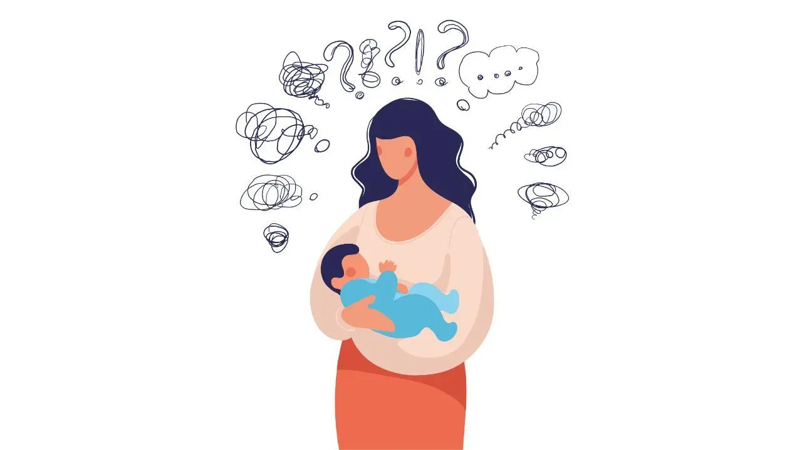</p>

---

## Overview

This project seeks to explore the relationship between maternal mental health and infant sleep behaviour, using a dataset of 410 mother–infant dyads. It examines patterns such as sleep fragmentation, postpartum depression, and infant temperament through a series of targeted research questions.

The analysis investigates how maternal and infant factors interact; for example, whether mothers with postpartum distress report infants who are more reactive or have more turbulent sleep patterns. Twelve key hypotheses are tested using non-parametric statistical methods (Kruskal–Wallis, Mann–Whitney U, Chi-Square, and Spearman’s Rank correlation). At the end of the project, an additional clustering analysis was performed to identify distinct infant sleep–temperament profiles.

---

## Data & ETL Process

The raw dataset (`Dataset_maternal_mental_health_infant_sleep.csv`) contained mixed-format survey data across both mothers and infants. The ETL process cleaned, standardised, and separated it into two structured datasets:

- `participant.csv` — demographic and infant-related variables
- `mental_health.csv` — psychological scales and maternal self-reports

**Key transformations:**
- Normalised and cleaned column names
- Removed redundant variables
- Renamed ambiguous columns (e.g. `gestationnal_age` → `infant_gestational_age`)
- Decoded numerical survey codes into descriptive categorical values
- Converted time strings (HH:MM) to numeric hours
- Split and saved two main dataframes for modular analysis

**ETL output:**
- `CSV_files/participant.csv`
- `CSV_files/mental_health.csv`

---

## Research Questions & Analyses

### 1. Infant Sleep Method vs Nightly Wakes
**Question:** Is there a correlation between infants' number of wakes per night and their method of sleeping?

```python
sleep_df = participant_df[['infant_sleeping_method','infant_wakes_per_night']].dropna()

groups = [g['infant_wakes_per_night'].values for _, g in sleep_df.groupby('infant_sleeping_method', observed=True)]

H, p = stats.kruskal(*groups)
```

**Test:** Kruskal–Wallis H-test  
**Results:** H = 66.253, p < 0.001, ε2 = 0.115  
**Interpretation:** Infants who fell asleep **independently (alone in crib)** woke significantly fewer times per night.

<p align="center">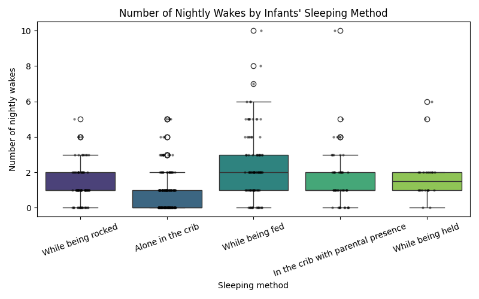</p>

---

### 2. Marital Status vs Postpartum Trauma (CBTS)
**Question:** Is there a correlation between a mother's marital status and worse PPD symptoms (high CBTS scores)?

```python
cbts_cols = [c for c in mental_health_df.columns if c.startswith('cbts_')]

cbts_df = participant_df[['participant_number','marital_status']].merge(mental_health_df[['participant_number',*cbts_cols]], on='participant_number')
cbts_df['cbts_total'] = cbts_df[cbts_cols].sum(axis=1, skipna=True)

U, p = stats.mannwhitneyu(cbts_df.query("marital_status=='Partnered'")['cbts_total'],
                          cbts_df.query("marital_status!='Partnered'")['cbts_total'])
```

**Test:** Mann–Whitney U test  
**Results:** U = 4279.00, p = 0.7136, r = 0.018  
**Interpretation:** No significant difference in postpartum trauma scores between partnered and unpartnered mothers.

<p align="center">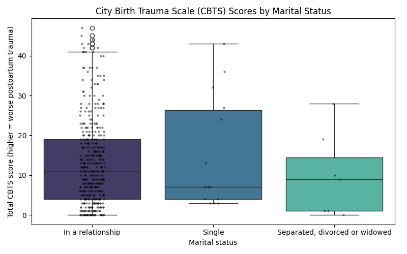</p>
<p align="center">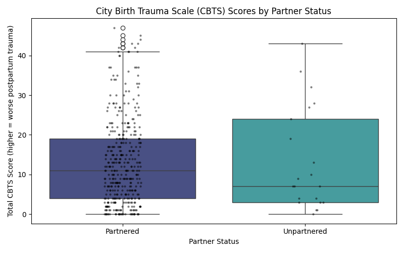</p>

---

### 3. Infant Age Group vs Nightly Wakes

**Question:** Is there a correlation between infants' age group and the number of times they wake up at night?

```python
age_df = participant_df[['infant_age_category','infant_wakes_per_night']].dropna()

H, p = stats.kruskal(*[g['infant_wakes_per_night'] for _, g in age_df.groupby('infant_age_category', observed=True)])
```

**Test:** Kruskal–Wallis H-test  
**Results:** H = 0.669, p = 0.716, ε2 ≈ 0.00  
**Interpretation:** Infant age (3–12 months) was **not significantly related** to the number of nightly wakes.

<p align="center">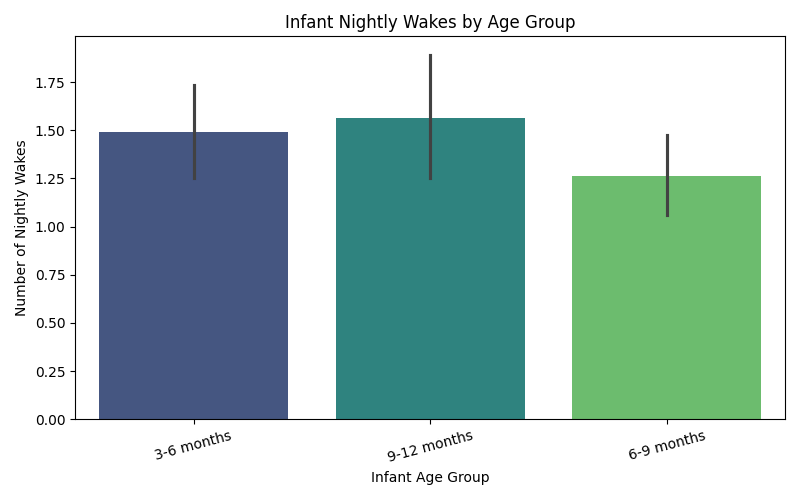</p>

---

### 4. Sleep Duration vs Sleeping Method

**Question:** Is there a correlation between an infant's sleep duration and their method of sleeping?

```python
sleepdur_df = participant_df[['infant_nightly_sleep_duration','infant_sleeping_method']].dropna()

H, p = stats.kruskal(*[g['infant_nightly_sleep_duration'] for _, g in sleepdur_df.groupby('infant_sleeping_method', observed=True)])
```

**Test:** Kruskal–Wallis H-test  
**Results:** H = 50.390, p < 0.001, ε2 = 0.115  
**Interpretation:** Infants falling asleep **independently** slept longer at night.

<p align="center">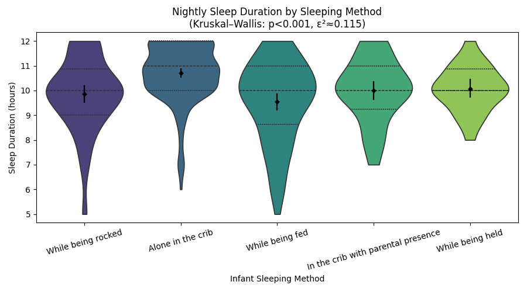</p>

---

### 5. Gestational Age vs IBQ-R Temperament

**Question:** Is there a correlation between an infant's gestational age at birth and their IBQ-R scores?

```python
ibq_df = participant_df[['participant_number','infant_gestational_age']].merge(mental_health_df[['participant_number',*ibq_cols]], on='participant_number')

ibq_df['ibq_mean'] = ibq_df[ibq_cols].mean(axis=1, skipna=True)

rho, p = stats.spearmanr(ibq_df['infant_gestational_age'], ibq_df['ibq_mean'])
```

**Test:** Spearman’s Rank Correlation  
**Results:** ρ = -0.033, p = 0.501  
**Interpretation:** No significant relationship between gestational maturity and infant temperament.

<p align="center">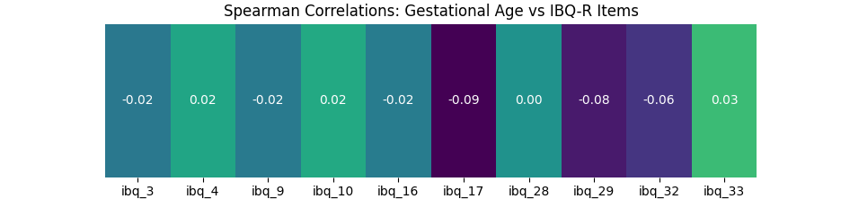</p>

---

### 6. Education Level vs Infant Sleep Method

**Question:** Is there a relationship between mothers' education level and the method they use to put their babies to sleep?

```python
grouped = edusleep_df.groupby('education')['infant_sleeping_method'].value_counts(normalize=True).unstack('infant_sleeping_method')

contingency = pd.crosstab(edusleep_df['education'], edusleep_df['infant_sleeping_method'])

chi2, p, dof, expected = chi2_contingency(contingency)
```

**Test:** Chi-square Test of Independence  
**Results:** χ²(16) = 14.400, p = 0.569, V = 0.094  
**Interpretation:** Mothers’ education level did **not significantly influence** how their infants fell asleep.

<p align="center">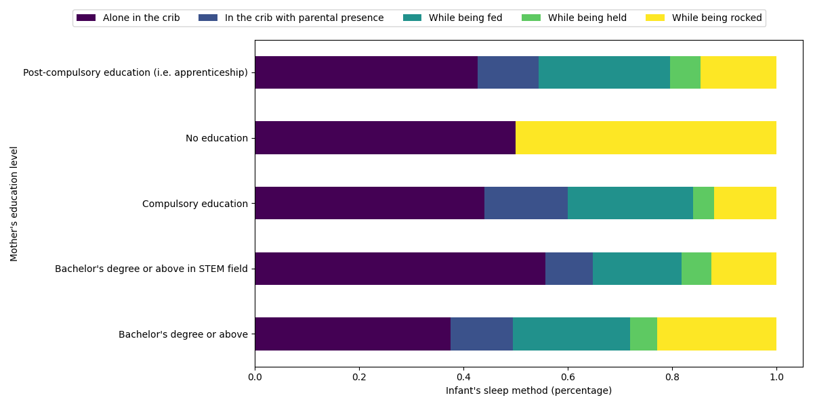</p>

---

### 7. Infant Sex vs Sleep Duration

**Question:** Is there a correlation between babies' sex and their sleep durations?

```python
ss_df = participant_df[['infant_sex', 'infant_nightly_sleep_duration']].dropna()

female = ss_df.loc[ss_df['infant_sex'] == 'Female', 'infant_nightly_sleep_duration']

male = ss_df.loc[ss_df['infant_sex'] == 'Male', 'infant_nightly_sleep_duration']

U, p = stats.mannwhitneyu(female, male, alternative='two-sided')

r = abs(stats.norm.ppf(p/2)) / (len(ss_df)**0.5)
```

**Test:** Mann–Whitney U test  
**Results:** U = 21861.00, p = 0.4073, r = 0.041  
**Interpretation:** **No difference** in sleep duration between male and female infants.

<p align="center">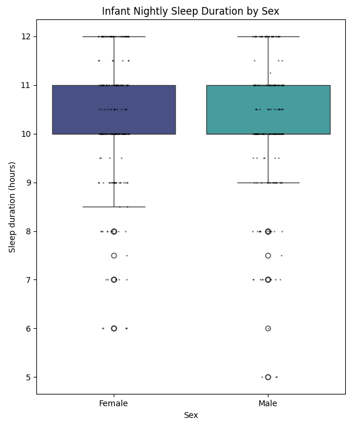</p>

---

### 8. Nightly Wakes vs IBQ-R Reactivity

**Question:** Is there a correlation between babies' sleep fragmentation (nightly wakes) and poorer scores on their IBQ-R results?

```python
for col in ibq_cols:
    x = ibq_df['infant_wakes_per_night']
    y = ibq_df[col]

    valid = (~x.isna()) & (~y.isna())
    if valid.sum() > 1:
        rho, p = stats.spearmanr(x[valid], y[valid])
    else:
        rho, p = (np.nan, np.nan)
    
    correlations.append({'item': col, 'rho': rho, 'p': p})

```

**Test:** Spearman’s Rank Correlation  
**Results:** Strongest correlations for:
- ibq_10 (ρ = 0.345, p < 0.001)
- ibq_16 (ρ = 0.272, p < 0.001)
- ibq_29 (ρ = 0.231, p < 0.001)


**Interpretation:** Infants with more frequent nightly wakes showed **higher emotional reactivity** on several IBQ-R dimensions.

<p align="center">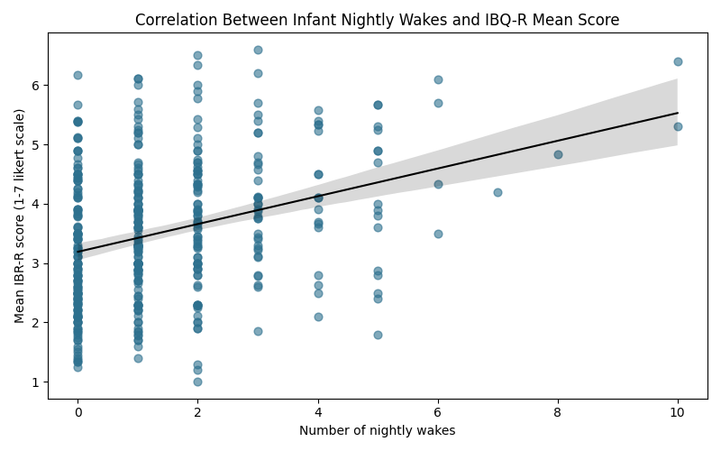</p>

---

### 9. Maternal Age vs CBTS & EPDS

**Question:** Are younger mothers more likely to experience postpartum trauma or depression (higher CBTS & EPDS scores)?

```python
rho_cbts, p_cbts = stats.spearmanr(agepp_df['age'], agepp_df['cbts_total'])

rho_epds, p_epds = stats.spearmanr(agepp_df['age'], agepp_df['epds_total'])
```

**Test:** Spearman’s Rank Correlation  
**Results:** ρ(CBTS) = -0.039, p = 0.434; ρ(EPDS) = -0.093, p = 0.060  
**Interpretation:** No statistically significant correlation, but a **weak negative trend** — younger mothers may experience slightly higher PPD risk.

<p align="center">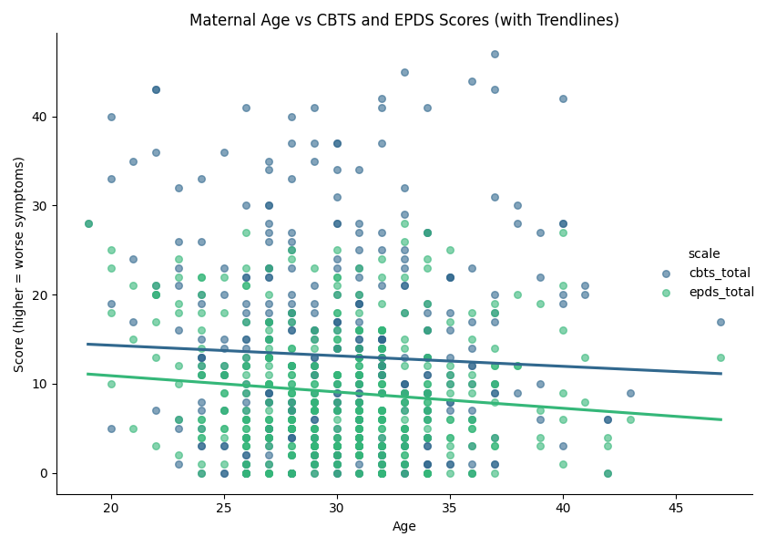</p>

---

### 10. Nightly Wakes vs Maternal Mental Health (CBTS, EPDS, HADS)

**Question:** Do mothers whose infants wake more frequently at night report higher CBTS, HADS, or EPDS scores?

```python
scales = ['cbts_total', 'epds_total', 'hads_total']

for s in scales:
    valid = nw_df[['infant_wakes_per_night', s]].dropna()
    rho, p = stats.spearmanr(valid['infant_wakes_per_night'], valid[s])
    print(f"Spearman: nightly wakes vs {s.upper()} -> ρ={rho:.3f}, p={p:.5f}")
```

**Test:** Spearman’s Rank Correlation  
**Results:**
- CBTS: ρ = 0.078, p = 0.115
- EPDS: ρ = 0.106, p = 0.031 (**significant**)
- HADS: ρ = 0.051, p = 0.301

**Interpretation:** Higher **infant sleep fragmentation** associated with **mildly elevated maternal depression scores (EPDS)**.

<p align="center">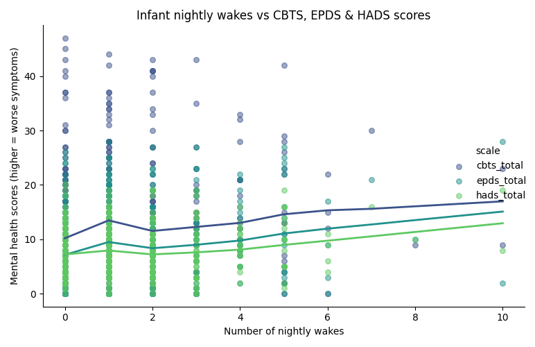</p>

---

### 11. Independent Sleepers vs IBQ-R Emotional Reactivity

**Question:** Do infants who fall asleep independently (alone in crib) score lower on the IBQ-R negative emotionality dimensions?

```python
a = ibq2_df.loc[ibq2_df['independent_sleep'], 'ibq_mean'].dropna()

b = ibq2_df.loc[~ibq2_df['independent_sleep'], 'ibq_mean'].dropna()

res = stats.mannwhitneyu(a, b, alternative='two-sided')

U, p = res.statistic, res.pvalue

r_rb = 1 - (2 * U) / (len(a) * len(b))
```

**Test:** Mann–Whitney U test  
**Results:** U = 14903.00, p < 0.001, r_rb = 0.277  
**Interpretation:** Infants who fell asleep independently had **lower negative emotionality scores**.

<p align="center">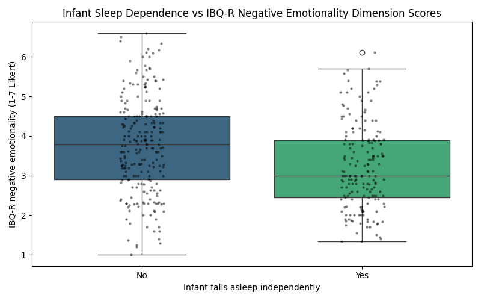</p>

---

### 12. Maternal PPD Symptoms vs Infant Distress (CBTS/EPDS vs IBQ-R)

**Question:** Is there a correlation between mothers with PPD symptoms and distressed/restless infants (high CBTS/EPDS vs high IBQ-R scores)?

```python
rho_cbts, p_cbts = stats.spearmanr(mh_df['cbts_total'], mh_df['ibq_mean'])

rho_epds, p_epds = stats.spearmanr(mh_df['epds_total'], mh_df['ibq_mean'])
```

**Test:** Spearman’s Rank Correlation  
**Results:**
- CBTS vs IBQ-R mean: ρ = 0.132, p = 0.0075  
- EPDS vs IBQ-R mean: ρ = 0.188, p < 0.001  
**Interpretation:** Mothers with higher postpartum distress (CBTS/EPDS) tend to have **infants with higher emotional reactivity**.

<p align="center">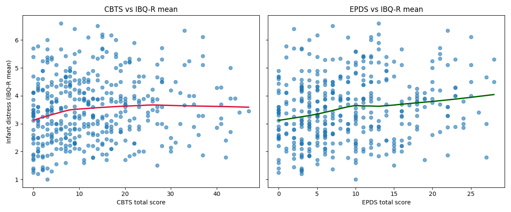</p>

---

### K-means Sleep-Temperament Clustering

**Question:** Can we identify distinct infant ‘sleep–temperament profiles’ (e.g., long sleepers with low distress vs short sleepers with high reactivity)?

**Methods:** Elbow/Silhouette to find best fitting k

**Output:**
<p align="center">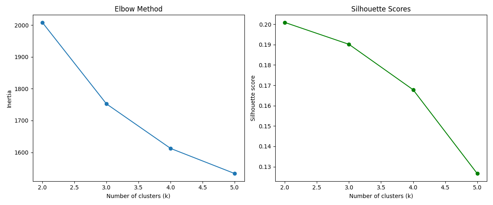</p>

**After fitting final k:**
<p align="center">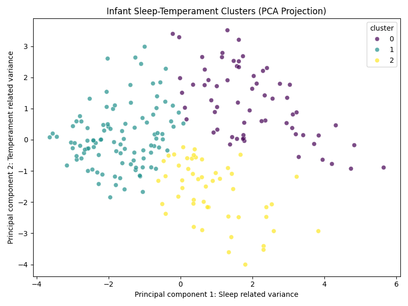</p>

**Interpretation:** According to the k-means algorithm results the clusters are loosely distinct, which suggests meaningful subgroups exist. However there’s some overlap, meaning infants vary along a continuum rather than strict categories. The diagonal patterns imply a relationship between sleep and temperament.

Cluster 0 (purple): Short sleepers, higher reactivity; infants who sleep less and show higher emotional intensity or distress.

Cluster 1 (teal): Longer sleepers, calmer temperament; infants who sleep longer, wake less, and display lower negative affect.

Cluster 2 (yellow): Moderate sleepers, low reactivity; infants with average sleep but lower reactivity/more adaptable temperament.


---

## Tools & Libraries
- **Python 3.11**  
- **Pandas**, **NumPy**, **Matplotlib**, **Seaborn**, **SciPy**, **Pingouin**  
- Non-parametric statistics: Kruskal–Wallis, Mann–Whitney U, Spearman’s ρ, Chi-square, Cramér’s V  
- Dataset cleaning and decoding in pandas; visualisations with Seaborn

---

## License
This project is open source under the **MIT License**.

<p align="center"><sub>Authored by <b>Sevban Ekşi (st3kin)</b> — 2025</sub></p>

